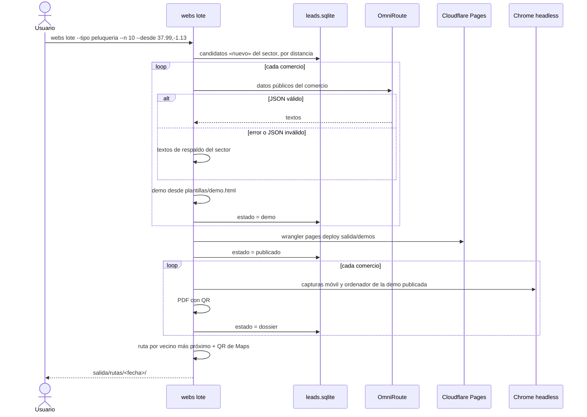
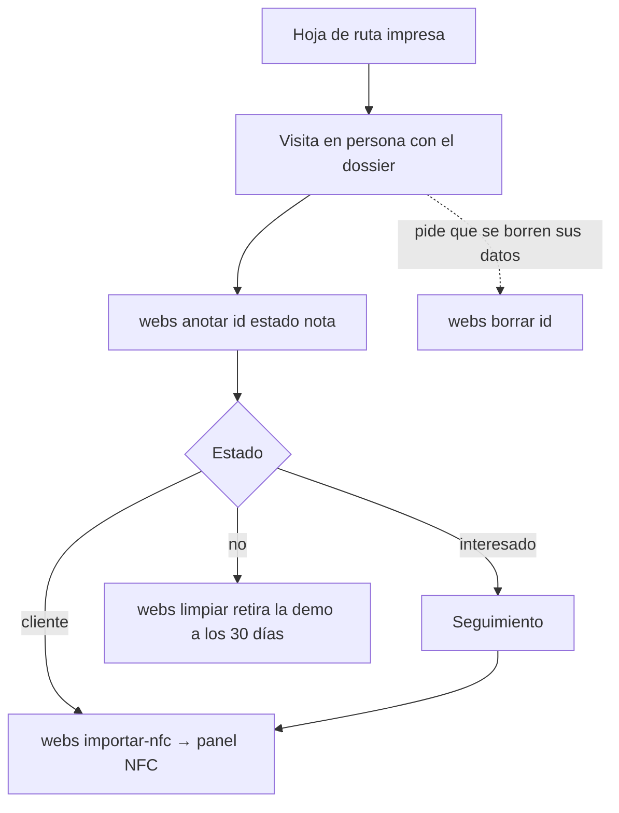

# Flujos principales

## Preparar un lote

```mermaid
sequenceDiagram
  actor U as Usuario
  participant CLI as webs lote
  participant DB as leads.sqlite
  participant LLM as OmniRoute
  participant P as Cloudflare Pages
  participant C as Chrome headless

  U->>CLI: webs lote --tipo peluqueria --n 10 --desde 37.99,-1.13
  CLI->>DB: candidatos «nuevo» del sector, por distancia
  loop cada comercio
    CLI->>LLM: datos públicos del comercio
    alt JSON válido
      LLM-->>CLI: textos
    else error o JSON inválido
      CLI->>CLI: textos de respaldo del sector
    end
    CLI->>CLI: demo desde plantillas/demo.html
    CLI->>DB: estado = demo
  end
  CLI->>P: wrangler pages deploy salida/demos
  CLI->>DB: estado = publicado
  loop cada comercio
    CLI->>C: capturas móvil y ordenador de la demo publicada
    CLI->>CLI: PDF con QR
    CLI->>DB: estado = dossier
  end
  CLI->>CLI: ruta por vecino más próximo + QR de Maps
  CLI-->>U: salida/rutas/<fecha>/
```

## Visita y seguimiento

```mermaid
flowchart TD
  A[Hoja de ruta impresa] --> B[Visita en persona con el dossier]
  B --> C[webs anotar id estado nota]
  C --> D{Estado}
  D -- interesado --> E[Seguimiento]
  D -- cliente --> F[webs importar-nfc → panel NFC]
  D -- no --> G[webs limpiar retira la demo a los 30 días]
  E --> F
  B -. "pide que se borren sus datos" .-> H[webs borrar id]
```
